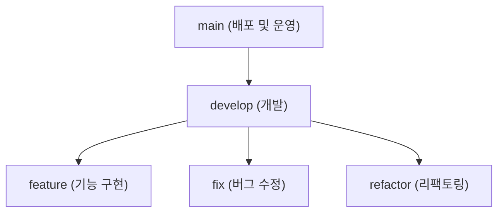
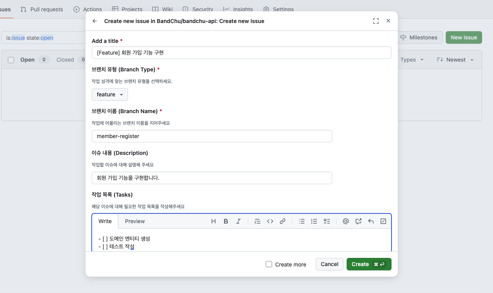
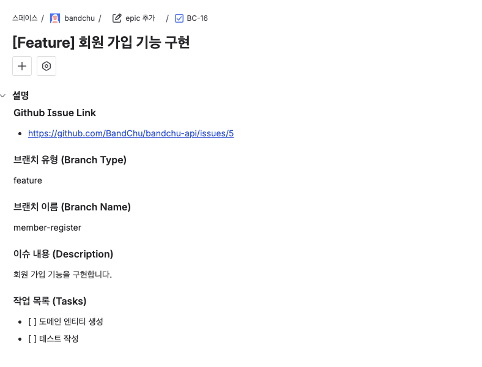
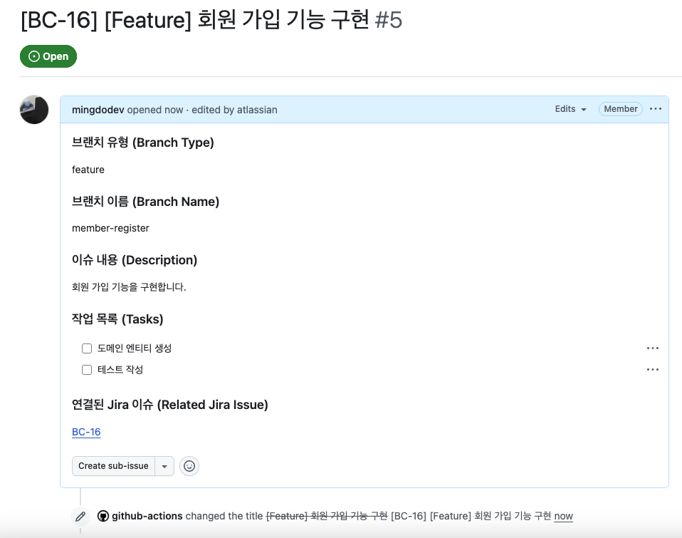
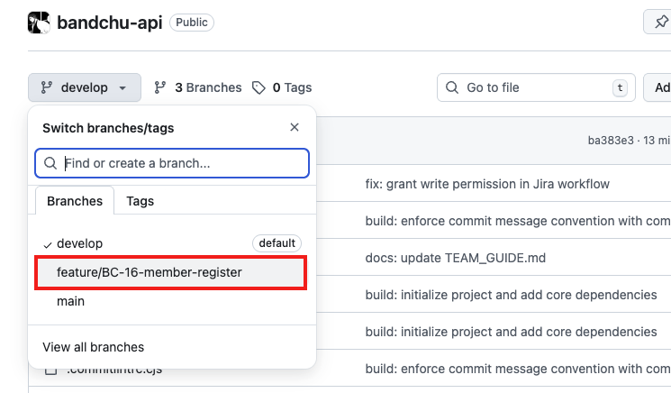
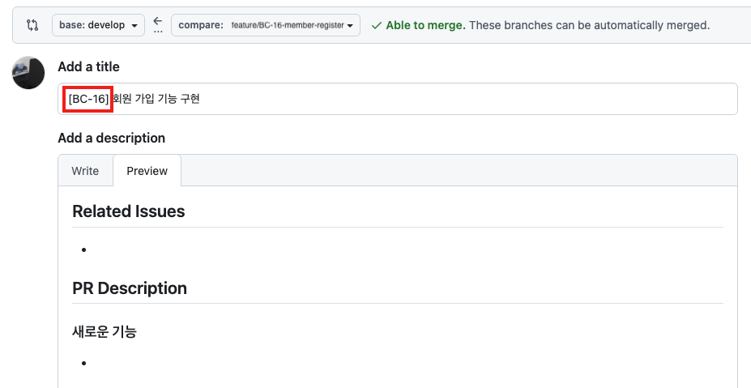
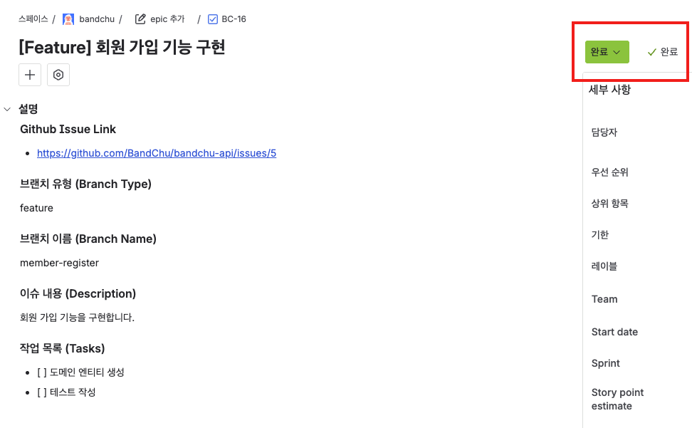
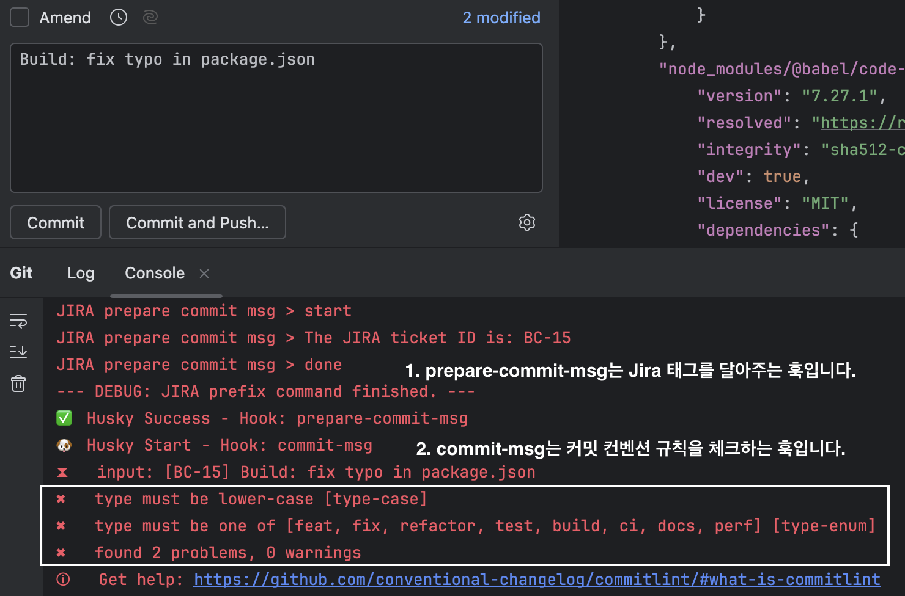

# 🌿 Branch Strategy

프로젝트에서 사용할 브랜치의 종류는 **main, develop, feature / fix / refactor** 로 분류됩니다.



### main

- 운영 서버에서 실행될 코드로, 항상 배포 가능한 상태를 유지합니다.
- PR(Pull Request)을 통해, `main` 브랜치에 `develop` 브랜치를 merge하여 배포합니다.

### develop

- 개발 단계에서 사용하는 브랜치로, 팀원들의 모든 작업은 `develop`에서 통합됩니다.
- PR(Pull Request)을 통해, `develop` 브랜치에 `feature/fix/refactor` 브랜치를 merge하여 통합합니다.

### feature / fix / refactor

- GitHub Issue를 기반으로 기능 단위 작업을 진행하는 브랜치입니다.
- 브랜치 네이밍은 `{branch-type}/{jira-ticket-number}-{branch-name}`으로 통일합니다.

<br>

## 📌 작업 프로세스

팀 협업은 **GitHub**와 **Jira**를 기반으로 진행합니다.  
**GitHub Issue** 생성 시, 자동으로 **Jira Task**가 만들어지고 해당 **티켓 번호 기반 브랜치**가 생성됩니다.

<br>

### 1. 이슈 생성

<div align="center"></div>

- 작업을 시작하기 전, 이슈 템플릿을 기반으로 GitHub Issue를 생성합니다.
- 브랜치 이름은 영문 소문자와 하이픈을 사용하는 것을 권장합니다.

### 2. Jira 브랜치 생성

<div align="center"></div>

- [GitHub Actions Workflow](https://github.com/BandChu/bandchu-api/blob/develop/.github/workflows/create-jira-issue.yml)가 이슈 생성 이벤트를 감지하여 Jira Task를 생성합니다.

<div align="center"></div>

- 생성된 Jira Task의 티켓 번호가 이슈 제목 앞에 자동으로 태그되며, 동일한 키를 포함한 브랜치가 자동으로 생성됩니다.  
  (예: `feature/BC-23-member-register`)

### 3. 생성된 브랜치에서 작업

<div align="center"</div>

```bash
git fetch origin
git checkout {생성된-브랜치-이름}
```

- 자동으로 생성된 브랜치에서 기능 구현, 버그 수정, 리팩토링 등 이슈 관련 작업을 진행합니다.

```bash
git pull origin develop
```
- 작업 중에는 주기적으로 위 명령어로 팀의 최신 `develop` 브랜치 변경사항을 반영해주세요!

### 4. PR(Pull Request) 생성

<div align="center"></div>

- 작업이 완료되면, `develop`에 작업 브랜치를 병합하기 위한 PR을 생성합니다.
- **PR 제목에도 Jira 티켓 번호를 포함**시켜 이력 추적성을 유지하도록 합니다. (예: [BC-16] 회원 가입 기능 구현)

### 5. 리뷰 및 머지(Merge)

- 코드 리뷰 또는 검토 과정을 거친 후 `develop` 브랜치로 머지합니다.

### 6. 이슈 자동 종료

<div align="center"></div>

- GitHub Issue가 닫히면, 연결된 **Jira Task의 상태도 자동으로 Done으로 변경**됩니다.

### 7. 브랜치 정리

- 머지된 브랜치는 삭제합니다.
- 이후 동일 티켓에 추가 작업이 필요할 경우, 동일 브랜치를 다시 열어 작업 후 PR을 새로 생성할 수 있습니다.

<br>

# ✨ Commit Convention

Angular 9의 Commit Message Format을 참고하여 **일관된 형식의 커밋 메시지를 작성**합니다.

<br>

## Husky&Commitlint 사용 방법

- **Husky** Hook을 통해, **Jira의 티켓 넘버가 자동으로 커밋 메시지 헤더 앞에 추가**됩니다.
- **Commitlint**를 통해, 커밋 메시지가 컨벤션 규칙에 맞지 않을 경우 커밋이 거부됩니다.

### 설치

```bash
npm install
```
- `git clone` 후 최초 1회 `npm install`을 실행하면, Jira 태그 자동화와 커밋 컨벤션 검증을 위한 **개발 의존성(Husky, Commitlint 등)** 이 설치됩니다.

### 사용 예시

<div align="center"></div>

- 커밋 컨벤션에 어긋난 커밋을 작성할 시 위와 같이 커밋이 거부됩니다.
- main, develop 이 아닌 브랜치에서는 Jira 티켓 넘버 태그가 자동으로 커밋 맨 앞에 추가됩니다.
- 콘솔 출력을 통해 어떤 훅이 실행되었는지, 성공 또는 실패했는지 확인할 수 있습니다.

<br>

## 커밋 메시지 구조

```
<type>(<optional scope>): <short summary>

<optional body>

<optional footer>
```

### Header
- **type**과 **short summary**를 반드시 포함합니다.
- **type**는 아래 표를 참고하여 표기합니다.
- **summary**는 명령형 현재 시제를 사용하며, 영문 소문자로 시작하고 마침표(`.`)을 붙이지 않습니다.
- **scope**는 커밋의 영향을 받는 범위를 의미하며, 도메인/모듈/함수명 등 필요한 경우 선택적으로 사용합니다.

### Body (optional)
- 변경 이유와 이전 동작 대비 차이점을 설명합니다.
- 명령형 현재 시제를 사용합니다. (`Fixed, Fixes` 대신 `Fix`를 사용)
- 여러 항목에 대한 설명이 필요하다면, 불렛 포인트(`-`)를 사용할 수 있습니다.

### Footer (optional)
- **관련된 이슈(issue)** 또는 **PR**을 참조할 수 있습니다.
- 해결된 항목은 `Fixes`, `Closes` 키워드를 사용하여 자동으로 닫을 수 있습니다. (e.g. `Fixes #1`, `Closes #2`)

<br>

## 헤더 타입

| 종류           | 설명                                                     |
|--------------|--------------------------------------------------------|
| **feat**     | 새로운 기능 추가                                              |
| **fix**      | 버그 수정 (예상치 못한 동작 또는 런타임 에러 수정)                         |
| **refactor** | 코드 구조 개선 (버그 수정이나 기능 추가 없이 가독성, 유지보수성, 설계 등을 변경)       |
| **test**     | 테스트 코드 추가/수정                                           |
| **build**    | 의존성 또는 빌드 환경 관련 변경 (예: `build.gradle.kts`)             |
| **ci**       | CI/CD 설정 파일 및 스크립트 추가/수정  (예: Github Actions, Jenkins) |
| **docs**     | 문서 변경 (예: README, Wiki, 주석)                            |
| **perf**     | 성능 개선 (쿼리 최적화, 불필요한 객체 생성 방지 등)                        |

<br>

## 커밋 메시지 예시

```
feat: implement user registration API

Add a new endpoint to handle user registration request.

#1
```
- 위와 같은 형태로 커밋 메시지를 작성합니다.

<br>

```
[BC-12] feat: implement user registration API

Add a new endpoint to handle user registration request.

#1
```
- 실제 커밋 이후에는 위와 같은 형태로 포맷됩니다.