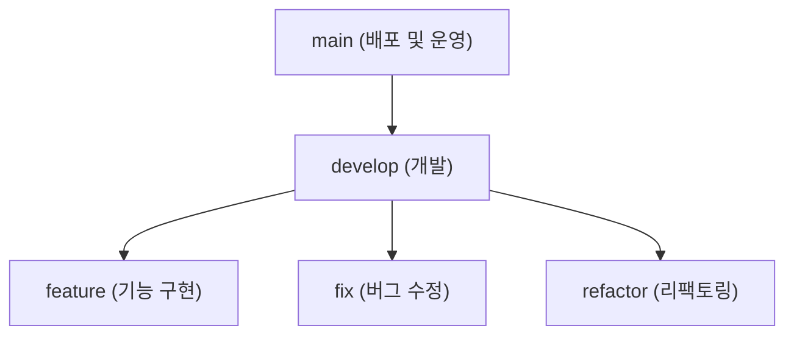

# 🌿 Branch Strategy

프로젝트에서 사용할 브랜치의 종류는 **main, develop, feature / fix / refactor** 로 분류됩니다.



### main

- 운영 서버에서 실행될 코드로, 항상 배포 가능한 상태를 유지합니다.
- `main` 브랜치에서 `develop` 브랜치를 merge하여 배포합니다.

### develop

- 개발 단계에서 사용하는 브랜치로, 팀원들의 모든 작업은 `develop`에서 통합됩니다.
- PR(Pull Request)을 통해, `develop` 브랜치에 `feature/fix/refactor` 브랜치를 merge하여 통합합니다.

### feature / fix / refactor

- GitHub Issue를 기반으로 기능 단위 작업을 진행하는 브랜치입니다.
- 브랜치 네이밍은 `{branch-type}/{jira-ticket-number}-{branch-name}`으로 통일합니다.

<br>

# ✨ Commit Convention

- Angular 9의 Commit Message Format을 참고하여 **일관된 형식의 커밋 메시지를 작성**합니다.

<br>

## 메시지 구조

```
<type>(<optional scope>): <short summary>

<optional body>

<optional footer>
```

### Header
- **type**과 **short summary**를 반드시 포함합니다.
- **type**는 아래 표를 참고하여 표기합니다.
- **summary**는 명령형 현재 시제를 사용하며, 영문 소문자로 시작하고 마침표(`.`)을 붙이지 않습니다.
- **scope**는 커밋의 영향을 받는 범위를 의미하며, 도메인/모듈/함수명 등 필요한 경우 선택적으로 사용합니다.

### Body (optional)
- 변경 이유와 이전 동작 대비 차이점을 설명합니다.
- 명령형 현재 시제를 사용합니다. (`Fixed, Fixes` 대신 `Fix`를 사용)
- 여러 항목에 대한 설명이 필요하다면, 불렛 포인트(`-`)를 사용할 수 있습니다.

### Footer (optional)
- **관련된 이슈(issue)** 또는 **PR**을 참조할 수 있습니다.
- 해결된 항목은 `Fixes`, `Closes` 키워드를 사용하여 자동으로 닫을 수 있습니다. (e.g. `Fixes #1`, `Closes #2`)

<br>

## 헤더 타입

| 종류           | 설명                                                     |
|--------------|--------------------------------------------------------|
| **feat**     | 새로운 기능 추가                                              |
| **fix**      | 버그 수정 (예상치 못한 동작 또는 런타임 에러 수정)                         |
| **refactor** | 코드 구조 개선 (버그 수정이나 기능 추가 없이 가독성, 유지보수성, 설계 등을 변경)       |
| **test**     | 테스트 코드 추가/수정                                           |
| **build**    | 의존성 또는 빌드 환경 관련 변경 (예: `build.gradle.kts`)             |
| **ci**       | CI/CD 설정 파일 및 스크립트 추가/수정  (예: Github Actions, Jenkins) |
| **docs**     | 문서 변경 (예: README, Wiki, 주석)                            |
| **perf**     | 성능 개선 (쿼리 최적화, 불필요한 객체 생성 방지 등)                        |

<br>

## 커밋 메시지 예시

```
feat: implement user registration API

Add a new endpoint to handle user registration request.

#1
```
- 위와 같은 형태로 커밋 메시지를 작성합니다.